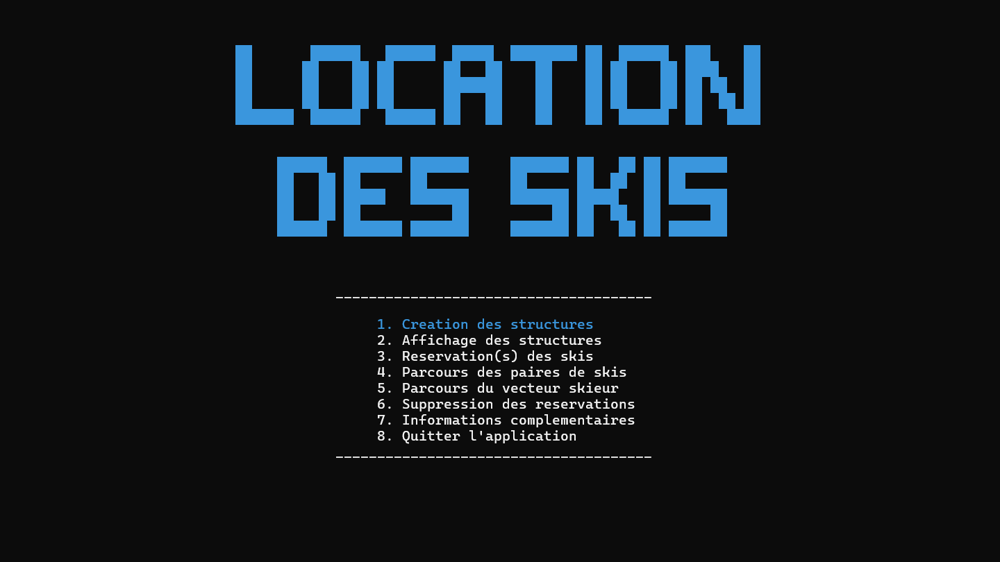

## Overview

Ski Rental System is a project I worked on with my friend Rayan during our first year of computer science in 2023. The main objective of this project is to manage, organize, and represent the reservation and rental of skis for a ski resort. We implemented this system using a linked list of sub-lists and a table of records. The application allows users to create, modify, delete, and browse these structures efficiently.

## Contributing

Contributions are welcome! Please fork the repository and submit a pull request with your changes. Ensure your code follows the project's coding standards and includes appropriate tests.

## License

This project is licensed under the MIT License. See the [LICENSE](LICENSE) file for details.